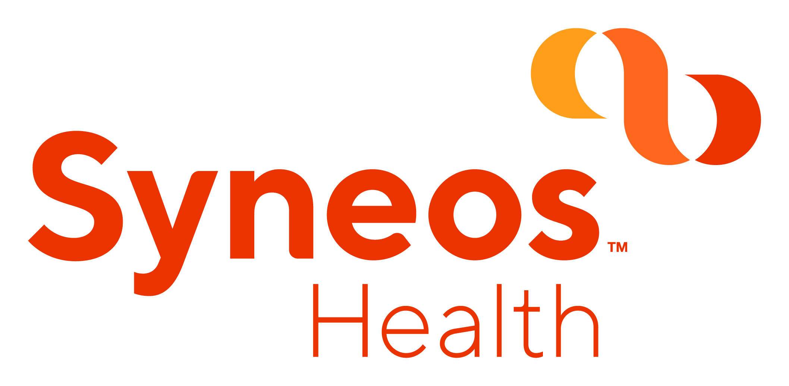

# { .container-sugg }

  SU GG

# Sponsors

 
 

:::::::::::::: {.columns}
::: {.column width="50%"}

{ style="background:none; border:none; box-shadow:none;" }

:::
::: {.column width="50%"}

{ style="background:none; border:none; box-shadow:none;" }

:::
::::::::::::::

# Communication

- [LinkedIn](https://www.linkedin.com/company/sas-user-group-germany/)
- [Meetup](https://www.meetup.com/sas-user-group-germany/)
- [sasusergg@gmail.com](mailto:sasusergg@gmail.com)
- [Slack](https://sug-germany.slack.com)
- mailing list?

# Survey

 

<https://www.surveymonkey.de/r/Y6TWDV3>

# SAS User Groups in Europe

:::::::::::::: {.columns}
::: {.column width="50%"}

###### UK & Ireland

[LinkedIn](https://www.linkedin.com/company/suguki/) [meetup](https://www.meetup.com/suguki/)

###### Belgium & Luxemburg

[LinkedIn](https://www.linkedin.com/company/sas-user-group-belux/) [meetup](https://www.meetup.com/BeLux-SAS-User-Group/)

:::
::: {.column width="50%"}

###### Germany

[LinkedIn](https://www.linkedin.com/company/sas-user-group-germany/) [meetup](https://www.meetup.com/sas-user-group-germany/)

###### Poland

[LinkedIn](https://www.linkedin.com/groups/8675451)

:::
::::::::::::::
